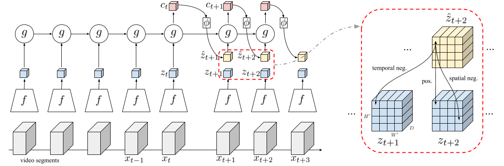

## Video Representation Learning by Dense Predictive Coding 

This repository contains the implementation of Dense Predictive Coding (DPC). 

Links: [[Arxiv](https://arxiv.org/abs/1909.04656)] [[Video](https://youtu.be/43KIHUvHjB0)] [[Project page](http://www.robots.ox.ac.uk/~vgg/research/DPC/dpc.html)]



### DPC Results

Original result from [our paper](https://arxiv.org/abs/1909.04656):

| Pretrain Dataset| Resolution | Backbone | Finetune Acc@1 (UCF101) | Finetune Acc@1 (HMDB51) |
|----|----|----|----|----|
|UCF101|128x128|2d3d-R18|60.6|-|
|Kinetics400|128x128|2d3d-R18|68.2|34.5|
|Kinetics400|224x224|2d3d-R34|75.7|35.7|

Also re-implemented by other researchers:
| Pretrain Dataset| Resolution | Backbone | Finetune Acc@1 (UCF101) | Finetune Acc@1 (HMDB51) |
|----|----|----|----|----|
|UCF101|128x128|2d3d-R18|61.35 [@kayush95](https://github.com/kayush95) |45.31 [@kayush95](https://github.com/kayush95) |

### News
* 2020/10/09: Upload [3D-ResNet18-UCF101-128x128](http://www.robots.ox.ac.uk/~htd/dpc/ucf101-rgb-128_resnet18_dpc.pth.tar) pretrained weights.
* 2020/06/05: Update the link for [3D-ResNet34-Kinetics400-224x224-runningStats](https://drive.google.com/file/d/1-WpsKzPNmSWuzoF2_qVfvfLOE1fwWD4x/view?usp=sharing), the [old one](https://drive.google.com/file/d/1d2XhuUwGTgEBg2cKkQbfJG8omHaSlELZ/view?usp=sharing) didn't save BN running statistics, thus couldn't be used to evaluate linear probe. Now it saves (without changing any weights).

### Installation

The implementation should work with python >= 3.6, pytorch >= 0.4, torchvision >= 0.2.2. 

The repo also requires cv2 (`conda install -c menpo opencv`), tensorboardX >= 1.7 (`pip install tensorboardX`), joblib, tqdm, ipdb.

### Prepare data

Follow the instructions [here](process_data/).

### Self-supervised training (DPC)

Change directory `cd DPC/dpc/`

* example: train DPC-RNN using 2 GPUs, with 3D-ResNet18 backbone, on Kinetics400 dataset with 128x128 resolution, for 300 epochs
  ```
  python main.py --gpu 0,1 --net resnet18 --dataset k400 --batch_size 128 --img_dim 128 --epochs 300
  ```

* example: train DPC-RNN using 4 GPUs, with 3D-ResNet34 backbone, on Kinetics400 dataset with 224x224 resolution, for 150 epochs
  ```
  python main.py --gpu 0,1,2,3 --net resnet34 --dataset k400 --batch_size 44 --img_dim 224 --epochs 150
  ```

### Evaluation: supervised action classification

Change directory `cd DPC/eval/`

* example: finetune pretrained DPC weights (replace `{model.pth.tar}` with pretrained DPC model)
  ```
  python test.py --gpu 0,1 --net resnet18 --dataset ucf101 --batch_size 128 --img_dim 128 --pretrain {model.pth.tar} --train_what ft --epochs 300
  ```

* example (continued): test the finetuned model (replace `{finetune_model.pth.tar}` with finetuned classifier model)
  ```
  python test.py --gpu 0,1 --net resnet18 --dataset ucf101 --batch_size 128 --img_dim 128 --test {finetune_model.pth.tar}
  ```

### DPC-pretrained weights

It took us **more than 1 week** to train the 3D-ResNet18 DPC model on Kinetics-400 with 128x128 resolution, and it tooks about **6 weeks** to train the 3D-ResNet34 DPC model on Kinetics-400 with 224x224 resolution (with 4 Nvidia P40 GPUs). 

Download link: 
* Kinetics400 pretrain:
  - [3D-ResNet18-Kinetics400-128x128](https://drive.google.com/file/d/1jbMg2EAX8armIQA6_0YwfATh_h7rQz4u/view?usp=sharing), 
  - [3D-ResNet34-Kinetics400-224x224](https://drive.google.com/file/d/1d2XhuUwGTgEBg2cKkQbfJG8omHaSlELZ/view?usp=sharing), 
  - [3D-ResNet34-Kinetics400-224x224-runningStats](https://drive.google.com/file/d/1-WpsKzPNmSWuzoF2_qVfvfLOE1fwWD4x/view?usp=sharing)
* UCF101 pretrain:
  - [3D-ResNet18-UCF101-128x128](http://www.robots.ox.ac.uk/~htd/dpc/ucf101-rgb-128_resnet18_dpc.pth.tar)

* example: finetune `3D-ResNet34-Kinetics400-224x224`
  ```
  python test.py --gpu 0,1 --net resnet34 --dataset ucf101 --batch_size 44 --img_dim 224 --pretrain {model.pth.tar} --train_what ft --epochs 300
  ```

### Citation

If you find the repo useful for your research, please consider citing our paper: 
```
@InProceedings{Han19dpc,
  author       = "Tengda Han and Weidi Xie and Andrew Zisserman",
  title        = "Video Representation Learning by Dense Predictive Coding",
  booktitle    = "Workshop on Large Scale Holistic Video Understanding, ICCV",
  year         = "2019",
}
```
For any questions, welcome to create an issue or contact Tengda Han ([htd@robots.ox.ac.uk](mailto:htd@robots.ox.ac.uk)).


